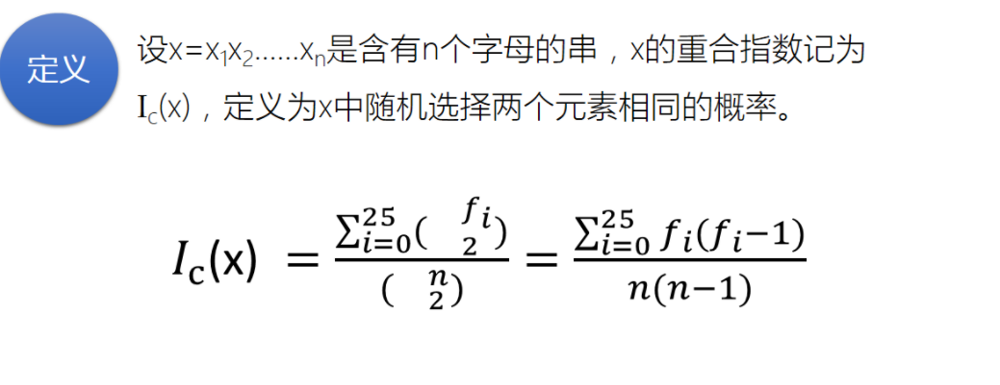

# 未知古典密码分析

## 待解决问题

**分析未知密码密文：**

**BNVSNSIHQCEELSSKKYERIFJKXUMBGYKAMQLJTYAVFBKVTDVBPVVRJYYLAOKYMPQSCGDLFSRLLPROYGESEBUUALRWXMMASAZLGLEDFJBZAVVPXWICGJXASCBYEHOSNMULKCEAHTQOKMFLEBKFXLRREDTZXCIWBJSICBGAWDVYDHAVEJXZIBKCGJIWEAHTTOEWTUHKRQVVRGZBXYIREMMASCSPBHLHJMBLRFFJELHWEYLWISTFVVYEJCMHYUYRUFSFMGESIGRLWALSWMNUHSIMYYITCCQPZSICEHBCCMZFEGVJYOCDEMMPGHVAAUMELCMOEHVLTIPSUYILVGFLMVWDVYDBTHFRAYISYSGKVSUUHYHGGCKTMBLRX**


## 题目分析


​		根据上图，分析前4种常见的古典密码可知，移位、仿射、代换都是单表代换，维吉尼亚密码是多表代换。单表代换不会改变文本的重合指数，多表代换会使重合指数发生变化，由原英文文本的0.065向完全随机文本的重合指数0.038变化。通过验证密文的重合指数可以区分出单表代换和多表代换。其中单表代换中的移位密码和仿射密码又可以通过穷举密钥加明文指数测试的方法求解出明文，如果不能给出明文解。说明不是移位密码或仿射密码，大概率是代换密码，需要通过频数分析的方法来求解。

## 重合指数Ic




## 明文指数Mg


Mg是英语文本的关于频数分布的度量。

Ic用于判断密文是否是单表单换的结果。

Mg是判断英语文本是否不是明文(有意义的文本)。

可以用Mg来判断是否是明文。

## 实验过程

### 1、求密文的重合指数，判断是哪一种加密方式

经计算密文的重合指数mg=0.041814,基本上可以确定加密方式是维吉尼亚密码。

下表为密文中各个字母出现次数和对应频率。

| 字母 | 频数 | 频率  |
| ---- | ---- | ----- |
| A    | 17   | 0.046 |
| B    | 17   | 0.046 |
| C    | 18   | 0.048 |
| D    | 9    | 0.024 |
| E    | 23   | 0.062 |
| F    | 14   | 0.038 |
| G    | 16   | 0.043 |
| H    | 17   | 0.046 |
| I    | 16   | 0.043 |
| J    | 12   | 0.032 |
| K    | 13   | 0.035 |
| L    | 23   | 0.062 |
| M    | 21   | 0.056 |
| N    | 4    | 0.011 |
| O    | 7    | 0.019 |
| P    | 8    | 0.021 |
| Q    | 6    | 0.016 |
| R    | 15   | 0.04  |
| S    | 23   | 0.062 |
| T    | 12   | 0.032 |
| U    | 12   | 0.032 |
| V    | 21   | 0.056 |
| W    | 11   | 0.029 |
| X    | 9    | 0.024 |
| Y    | 22   | 0.059 |
| Z    | 7    | 0.019 |

### 2、分析维吉尼亚密码

#### (1)确定分组数m。

#### 方法一：Kasiski测试法

根据重复出现的密文串的位置来确定m的值，找出重复出现的长度为3的密文串，计算它们之间的距离，并求解最大公约数来确定分组长度。由于密文长度太短，又或者是该密文是特殊构造的，用Kasiski测试法没有找到重复出现3次以上的长度为3的字符串。

**Kasiski代码**

```c++
int Kasiski(string s)
{
	int m = 0;
	int len = s.length();
	for (int i = 0; i < len - 2; i++)
	{
		string chr = "";
		chr = chr + s[i] + s[i + 1] +s[i + 2];
		int c = 0;//记录出现次数
		int index[100];
		memset(index, 0, sizeof(index));
		for (int j = 0; j < len - 2; j++)
		{
			string tmp = "";
			tmp = tmp + s[j] + s[j + 1] +s[j + 2];
			
		if (chr == tmp)
		{
			index[c++] = j;
		}
	}
	if (c > 2)
	{
		for (int k = 1; k < c; k++)//计算距离
		{
			index[k] = index[k] - index[0];
		}
		int g = gcd(index[1], index[2]);
		for (int k = 3; k < c; k++)
		{
			g = gcd(g, index[k]);
		}
		if (m == 0)m = g;
		else {
			if (m == g)m = g;
			else m = gcd(m, g);
		}
	}
}
return m;
}
```
#### 方法二：穷举m值，用重合指数Ic验证

下表为分组为m时，对应各分组重合指数以及重合指数均值(部分表格)

| 组数m    |            |            |            |            |            |            |            |           |            |            |            |            |        | 均值       |
| -------- | ---------- | ---------- | ---------- | ---------- | ---------- | ---------- | ---------- | --------- | ---------- | ---------- | ---------- | ---------- | ------ | ---------- |
| m=1      | 0.0418     |            |            |            |            |            |            |           |            |            |            |            |        | 0.0418     |
| m=2      | 0.0456     | 0.0464     |            |            |            |            |            |           |            |            |            |            |        | 0.046      |
| m=3      | 0.0446     | 0.0481     | 0.0484     |            |            |            |            |           |            |            |            |            |        | 0.0471     |
| m=4      | 0.0471     | 0.0575     | 0.0465     | 0.0475     |            |            |            |           |            |            |            |            |        | 0.0497     |
| m=5      | 0.045      | 0.0425     | 0.0418     | 0.0455     | 0.037      |            |            |           |            |            |            |            |        | 0.0424     |
| **m=6**  | **0.0512** | **0.0635** | **0.055**  | **0.0698** | **0.0576** | **0.0698** |            |           |            |            |            |            |        | **0.0612** |
| m=7      | 0.0405     | 0.0454     | 0.0443     | 0.0377     | 0.0493     | 0.0319     | 0.0464     |           |            |            |            |            |        | 0.0422     |
| m=8      | 0.0583     | 0.0592     | 0.0509     | 0.0481     | 0.0379     | 0.0647     | 0.0464     | 0.0502    |            |            |            |            |        | 0.052      |
| m=9      | 0.0488     | 0.0441     | 0.0418     | 0.036      | 0.0402     | 0.0402     | 0.0427     | 0.0451    | 0.0622     |            |            |            |        | 0.0446     |
| m=10     | 0.0654     | 0.0413     | 0.0256     | 0.0435     | 0.0405     | 0.0405     | 0.0541     | 0.0495    | 0.0601     | 0.0511     |            |            |        | 0.0472     |
| m=11     | 0.0499     | 0.041      | 0.0446     | 0.0374     | 0.0303     | 0.0553     | 0.0428     | 0.0357    | 0.0357     | 0.0517     | 0.0511     |            |        | 0.0432     |
| **m=12** | **0.0544** | **0.0645** | **0.0516** | **0.0624** | **0.0667** | **0.1226** | **0.0452** | **0.071** | **0.0473** | **0.0817** | **0.0667** | **0.0559** |        | **0.0658** |
| m=13     | 0.0493     | 0.0394     | 0.0493     | 0.0369     | 0.0246     | 0.0443     | 0.0567     | 0.032     | 0.0468     | 0.045      | 0.037      | 0.0423     | 0.0291 | 0.041      |

发现m=6和m=12时，重合指数均接近0.065，所以基本可以确定m=6。

**相关代码**

	double mmg = 0;
	fprintf(fp, "输出分组为m的各组重合指数\n");
	for (int i = 1; i <= 20; i++)
	{
		string tmp[20];
		for (int j = 0; j < s.length(); j++)
		{
			tmp[j % i] += s[j];
		}
		mmg = 0;
		fprintf(fp,"m=%d,", i);
		for (int j = 0; j < i; j++)
		{
			tmp[j][tmp[j].length()] = '\0';
			fprintf(fp,"%.4f,", Mg(tmp[j], true));
			mmg = mmg + Mg(tmp[j], true);
		}
	    mmg = mmg / i;
	    int n = 20 - i;
	    while (n--)fprintf(fp, ",");
	    fprintf(fp,"%.4f\n", mmg);
	    if (mmg >= 0.06)
	    {
	        if (m == 0||m==1)m = i;
	        else m = gcd(m, i);
	    }
	}
	cout <<"m=" << m << endl;

#### (2)求解加密密钥

维吉尼亚密码的每一组是一个简单的移位密码，可以通过穷举密钥的方法来破解，并用明文指数来判断是否是明文。

经计算，密钥为**theory**

| i    | Mg(yi)的值   |        |        |              |        |              |              |        |        |        |              |        |        |
| ---- | ------------ | ------ | ------ | ------------ | ------ | ------------ | ------------ | ------ | ------ | ------ | ------------ | ------ | ------ |
| 1    | 0.0359       | 0.0334 | 0.0343 | 0.0456       | 0.0371 | 0.0397       | 0.0348       | 0.0465 | 0.0345 | 0.0365 | 0.0357       | 0.0443 | 0.0355 |
|      | 0.028        | 0.0408 | 0.0427 | 0.0338       | 0.035  | **t 0.0610** | 0.041        | 0.0326 | 0.0337 | 0.0455 | 0.0343       | 0.0377 |        |
| 2    | 0.0349       | 0.0324 | 0.0458 | 0.038        | 0.036  | 0.0361       | **h 0.0691** | 0.0365 | 0.0308 | 0.0277 | 0.0467       | 0.0307 | 0.0383 |
|      | 0.038        | 0.0365 | 0.0346 | 0.039        | 0.0481 | 0.0405       | 0.045        | 0.0329 | 0.042  | 0.0362 | 0.0352       | 0.0294 |        |
| 3    | 0.0355       | 0.031  | 0.0379 | **e 0.0611** | 0.0362 | 0.0304       | 0.0369       | 0.0458 | 0.0283 | 0.0337 | 0.0357       | 0.0386 | 0.0396 |
|      | 0.0444       | 0.044  | 0.0388 | 0.0417       | 0.035  | 0.0388       | 0.0371       | 0.0341 | 0.0341 | 0.0366 | 0.0351       | 0.0374 |        |
| 4    | 0.0419       | 0.0397 | 0.0433 | 0.0376       | 0.0305 | 0.0309       | 0.0322       | 0.0289 | 0.0332 | 0.0527 | 0.0373       | 0.0291 | 0.0402 |
|      | **o 0.0682** | 0.0432 | 0.0338 | 0.0335       | 0.0441 | 0.0292       | 0.0322       | 0.0338 | 0.0328 | 0.0337 | 0.0423       | 0.0532 |        |
| 5    | 0.0401       | 0.048  | 0.035  | 0.0448       | 0.036  | 0.0425       | 0.0344       | 0.0328 | 0.0344 | 0.036  | 0.0371       | 0.0329 | 0.0469 |
|      | 0.0334       | 0.0291 | 0.042  | **r 0.0629** | 0.0404 | 0.0341       | 0.0369       | 0.0374 | 0.033  | 0.0381 | 0.0411       | 0.0306 |        |
| 6    | 0.0345       | 0.0361 | 0.0273 | 0.0373       | 0.0489 | 0.034        | 0.0405       | 0.0438 | 0.0451 | 0.0382 | 0.0399       | 0.0348 | 0.0376 |
|      | 0.0335       | 0.0279 | 0.0395 | 0.0366       | 0.0403 | 0.0386       | 0.0535       | 0.0369 | 0.0334 | 0.0357 | **y 0.0645** | 0.0333 |        |

#### (3)根据密钥求解明文

明文：

**igrewupamongslowtalkersmeninparticularwhodroppedwordsafewatatimelikebeansinahillandwhenigottominneapoliswherepeopletookalakewobegoncommatomeantheendnfastoryicouldntspeakawhnlesentenceincompanyandwasconsiderednottoobriahtsoienrolledinaspeechcouqsetaughtbyorvillesandthefounderofreflexiverelaxologyaselfhypnotictechniquethatenabledapersontospeakuptothreehundredwordsperminute**

整理：

l grew up anong slow talkers,men in particular,who dropped words a few  at a time like beansin a hill, and when I got to Minneapolis where  people took a Lake Wobegon comma to mean theend of a story, I couldn't  speak a whole sentence in company and was considered not too bright.So I enrolled in a speech course taught by Orville Sand, the founder of  reflexive relaxology, aself-hypnotic technique that enabled a person to  speak up to three hundred words per minute.

代码

```
string Vigenere_Dncode(string s, string key)
{
	int len1 = s.length(), len2 = key.length();
	string m;
	for (int i = 0; i < len1; i++)
	{
		m = m + char((int(s[i] - 'a') - (key[i % len2] - 'a') + 26) % 26 + 'a');
	}
	return m;
}
```

# 扩展

